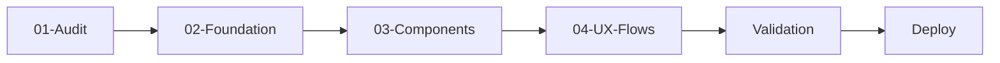

# UI Upgrade Playbook

**Agent-First UI/UX Upgrade Framework for React Dashboards**

> **Purpose:** Enable AI agents (Claude Code, Google Antigravity, etc.) to systematically upgrade internal dashboard/admin tool UIs from "xấu" to professional, consistent, and usable.

---

## 🎯 Target Audience

This framework is designed for **AI agents**, not humans. Every document, prompt, and playbook is written to be:
- Machine-readable and actionable
- Self-contained with clear input/output
- Validatable with success criteria

---

## 📦 What's Inside

```
ui-upgrade-playbook/
├── README.md                 # This file
├── AGENTS.md                 # How agents should use this framework
├── skills/
│   └── required-skills.md    # Agent skills to install + activation
├── design-system/
│   ├── tokens.json           # Machine-readable design tokens
│   ├── guidelines.md         # Visual design principles
│   └── components/           # Component specifications
├── playbooks/
│   ├── 01-audit/             # Audit current UI state
│   ├── 02-foundation/        # Setup design tokens + base styles
│   ├── 02.5-layout/          # Layout patterns (typography, spacing)
│   ├── 03-components/        # Rebuild component library
│   ├── 03.5-interactions/    # Micro-interactions (hover, loading, etc.)
│   └── 04-ux-flows/          # Fix navigation + user flows
├── validation/
│   └── checklist.md          # Verification criteria per step
└── examples/
    └── before-after/         # Example transformations
```

---

## 🚀 Quick Start for Agents

```markdown
1. Read AGENTS.md first
2. Install required skills (see skills/required-skills.md)
3. Execute playbooks in order:
   - 01-Audit
   - 02.5-Select (optional, if user wants UI library)
   - 02-Foundation
   - 03-Components
   - 04-UX-Flows
4. Validate each step using validation/checklist.md
```

---

## 📋 Playbook Overview

| Playbook | Goal | Estimated Time | Output |
|----------|------|----------------|--------|
| **01-Audit** | Assess current UI state | 15-30 min | Audit report + priority list |
| **02.5-Select** | Choose UI library | 15-30 min | Library selection + setup |
| **02-Foundation** | Setup design tokens | 30-60 min | tokens.json + global styles |
| **02.5-Layout** | Layout patterns | 30-45 min | Consistent layouts |
| **03-Components** | Rebuild components | 2-4 hours | Component library |
| **03.5-Interactions** | Micro-interactions | 30-45 min | Polished animations |
| **04-UX-Flows** | Fix navigation flows | 1-2 hours | Improved UX patterns |

---

## 🛠️ Required Agent Skills

- `frontend-design` — Core UI/UX design capability
- `ui-ux-pro-max` — Design system intelligence
- `vercel-react-best-practices` — React performance patterns
- `web-design-guidelines` — Accessibility + best practices

See `skills/required-skills.md` for installation instructions.

---

## 📐 Design Philosophy

**For Internal Dashboards:**
1. **Clarity over creativity** — Function first, form supports function
2. **Consistency over uniqueness** — Same patterns everywhere
3. **Speed over beauty** — Fast to use, fast to load
4. **Accessibility as default** — Works for everyone, automatically

---

## 🔄 Workflow Summary



Each playbook:
1. Reads context from previous steps
2. Executes specific tasks with provided prompts
3. Produces validated output
4. Passes context to next step

---

## 📝 Version

- **Version:** 1.0.0
- **Created:** 2026-03-10
- **Target:** React Admin Dashboards
- **Framework:** Agent-First Design

---

## 🏛️ Organization

Part of **FINOLABS** Agent Tools Collection.
